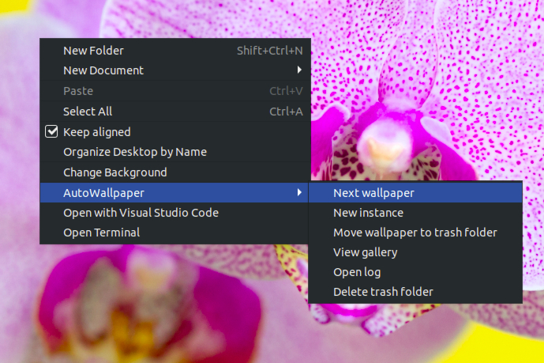

# AutoWallpaper #

Script that changes your (GNOME) desktop wallpaper every minute! 
Based on a <a href="https://t.me/TaskerSuperBrasilCanal/872">Tasker project</a> created by <a href="https://t.me/TaskerSuperBrasil">Tasker Super Brasil</a> Telegram group.

## Usage ##
Just create a folder on `~/Pictures` named `Wallpapers` and move your wallpapers there! 
Every minute, the daemon will randomize a file at `/home/$USER/Pictures/Wallpapers` and set it as desktop background.  

## Log ##
The script generates logs inside the `log` folder.  
**Format:**

* log/
    * full-log.log
    * date-1/
        * log.log
    * date-2/
        * log.log
        
        
Every execution, the `AW-Main.sh` script calls `AW-Change.sh` which calls `AW-Log.sh` script which checks if there's a folder named with the current date (date +%Y-%m-%d). If there's not, it creates it. Every time it logs, it write a new entry on both `full-log.log` and `date-xyz/log.log` files.

## settings.conf ##
I've included a file named `settings.conf` (located on the project's root). You can use it to tweak things like folders location. 
* `log`: Boolean related to logging. It can be either `true` or `false`. If it's set to `false`, all logs are disabled (every option that starts with `log_` will only work if this option is set to `true`.)
    * `log_wallpaper_changes`: Also a boolean. If set to `true`, it'll create a new log entry every time the wallpaper changes, indicating the chosen file.
    * `log_wallpaper_deletions`: Boolean that creates a new log entry every time the `AW-Trash.sh` file is executed with no parameter.
    * `log_new_instances`: New log entry on new instances (boolean).
    * `log_time_format`: String that sets the format of new log entries. Default value: `$date ($time): `. The user can write any value, including UNIX built-in variables (e.g $RANDOM, $DISPLAY, $PWD, $PATH, $USER, etc. A list of enviroment variables can be accessed through `printenv` command.)
* `notification`: Boolean related to notifications. It can be either `true` or `false`. If it's set to `false`, all notifications are disabled.
    * `notification_new_instances`: "New instance started."
    * `notification_new_instances_fail`: "Deleted trash folder successfully."
    * `notification_delete_trash_folder_fail`: "Trash folder didn't exist, so no files were deleted!"
    * `notification_delete_wallpaper`: "Moving wallpaper to trash..."
    * `notification_wallpaper_change`: "Wallpaper changed. New wallpaper: $wallpaper" (where `$wallpaper` means the wallpaper filename).
* `wallpaper_folder_location`: Path to local wallpaper folder.
* `sleep_time`: Time between wallpaper change (in seconds).   

## nautilus-actions ##
On Ubuntu 14.04 LTS, Xenial 16.04 LTS and Artful 17.10, the `nautilus-actions` package can be installed through normal installation procedures. 
On Linux versions newer then those, you can follow <a href="https://askubuntu.com/questions/1030940/nautilus-actions-in-18-04">this</a> link to install it. 
I've included a folder named `nautilus-actions` which includes files that are supposed to be imported on Nautilus Actions. 
The project **WORKS** without it but it's just way cooler to use it:  

**P.S.:** I've included a folder named `wallpapers`, which contain 13 landscape 1920x1080 wallpapers. They'll be used if `wallpaper_folder_location` isn't set or isn't a valid directory.
